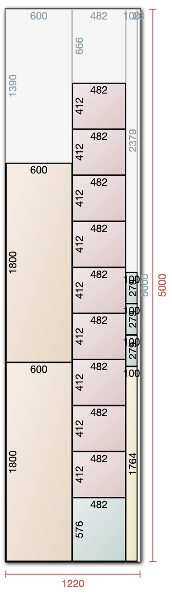

# DJ Table

- [DJ Table](#dj-table)
  - [Introduction](#introduction)
  - [Important facts](#important-facts)
  - [List of Woodcuts](#list-of-woodcuts)
  - [Model](#model)
  - [Cut lists](#cut-list)
  - [Assembly](#assembly)

## Introduction

Inspired by the sleek, functional design found on JJ Boooth's projects, I embarked on creating my own DJ table tailored to my specific needs and aesthetics. This site documents the journey from conceptualization to the final product, detailing each step of the process for fellow enthusiasts and DIYers.

## Important facts

Before diving into the construction, it's crucial to consider the dimensions and specifications of the equipment and materials to ensure everything fits perfectly and functions seamlessly.

| Name                       | Value     | Comments                            |
| -------------------------- | --------  | --------                            |
| Size of a record sleeve    |  31.43 cm | Normal vinyl cover size             |
| Size of a singles sleeve   |  18.50 cm | Singles vinyl cover                 |
| Good height for a DJ table | 100.00 cm | Plus the height of the DJ equipment |

| Equipment       | Height [mm] | Width [mm] | Depth [mm] |
|-----------------|-------------|------------|------------|
| CDJ Nexus 3000  | 118         | 453        | 329        |
| CDJ Nexus 2000  | 114         | 415        | 320        |
| Xone:92         | 88          | 358        | 320        |

## List of Woodcuts

A precise list of materials and dimensions is essential for efficiency and minimizing waste. Below is a comprehensive table listing each piece required for the build, along with their dimensions and quantity.

| ID | Piece                               | Amount | Height [mm] | Width [mm] | Thickness [mm] | m^2 p.P. | m^2 total |
|----|-------------------------------------|--------|-------------|------------|----------------|----------|-----------|
| 1  | Side walls                          | 2      | 960         | 600        | 18             | 0.58     | 1.16      |
| 2  | Slot dividers                       | 9      | 412         | 482        | 18             | 0.20     | 1.80      |
| 3  | Center horizontal divider (shorter) | 1      | 482         | 1764       | 18             | 0.85     | 0.85      |
| 4  | Singles level                       | 1      | 482         | 576        | 18             | 0.28     | 0.28      |
| 5  | Bottom and Top                      | 2      | 600         | 1800       | 18             | 1.08     | 2.16      |
| 6  | Floor piece front and back          | 2      | 120         | 1700       | 18             | 0.20     | 0.40      |
| 7  | Floor piece sides                   | 2      | 120         | 464        | 18             | 0.06     | 0.12      |
| 8  | View protection for equipment       | 2      | 100         | 1764       | 18             | 0.18     | 0.36      |
| 9  | Front horizontal                    | 6      | 100         | 279        | 18             | 0.03     | 0.18      |
| 10 | Front vertical                      | 5      | 842         | 100        | 18             | 0.08     | 0.40      |
| 11 | Front wall                          | 1      | 842         | 1764       | 18             | 1.49     | 1.49      |
| 12 | Top piece (CDJ level)               | 1      | 600         | 1764       | 18             | 1.06     | 1.06      |
|    | **Total**                           |        |             |            |                |          | **7.71**  |

## Model

For easier visuailzation (And to ensure the above cuts really work :3) I created a small model out of cardboard. 

I used 2mm thick cardboard and used a scale of 1 to 10. With that the thickness of the cardboard almost matched.

The back of the DJ table with space for records, headphones and other things.

The front of the DJ table with small spaces for decoration, i.e. singles, plants, lava lamp, etc.

NOTE: As of now, the model does not have the cuts for the holes in the very top to put the CDJs and mixer in. They will come soon.

## Cut list

After creating the model, I prepared optimized cut list based on the table of the list of wood cuts above. I used a [software I found online](https://www.cutlistoptimizer.com/) to draw the images. I came up with 2 different versions:

  
   

## Wood glazing

I chose a teak wood glaze for the spruce to enhance its aesthetic appeal and protect the surface.

So before any of the assembly steps are done. All pieces are proprely coated.
Unforunately the sides of the pieces did not come out evenly colored. 

To fix this, I'll sand the sides that are visible after the assembly with a sander and re-paint them later.

## Metal Parts
Here is a table listing the metal parts needed for the assembly:

| Part         | Type                    | Details |
|------------- |-------------------------|---------|
| Big Screws   | Self drilling long ones | Used to screw together the wooden pieces directly |
| Small Screws | 16mmx2.5mm              | Used to screw the L-Shapes to the wood |
| L-Shapes     | Metal wide L-Shapes     | Used for stabilization |

Make sure to use the appropriate size and type of screws, L-shapes, brackets, nuts, and washers for the assembly.

## Assembly

Some impressions of the assembly of the piece. Unfortunately I did not make as many pictures as I hoped, because I got too much into the flow of finally assembling it.

Also, excuse the chaos of random things everywhere. We had a water damage and had to get literally everything replaced because of mold :)

First I assemble the bottom piece to the side pieces to form a wide U shape.

Then I places the vertical front pices on the gound and placed the front panel wall on top of them. This ensured that the wall insode the U shape had the correct distance from the ground.

Then I added the center divider, again by using slot divider parts to ensure the distance from the bottom piece was 100% correct.

A view how it looks when standing up.

Using the same technique with the slot dividers to ensure the correct height from the horizontal center divider, I mounted the top piece.

To allow the cables to be hidden, some wide hole was cut in. I drilled two big holes with a drill on each end and connected them with the jigsaw.

Later on I added another such whole on the further left side of the DJ Table (Where we have the power plug in our studio)

The front view protection was mounted. Together we decided to not lower the front piece into the DJ Table, bu thave it directly at the outmost point, creating no deepening..

Better view of the top and hole

The slot divider pieces were then added. This required a lot of measuring and caluations

Afrer all slot dividers, the second top view protection and floor piece were all assmeblied, they could soon be put together.

Abother angle

The holes for the CDJs and mixer had to be cut out of the top plate. This was done drilling holes along the markings and usind the jigsaw to cut out the pices.

*Attention* Cut along the "thin" middle line parts first. This way these don't have to hold the weight of the whole piece when being the last attached part to it. I.e. perpendicular to the wood grain first, when along.

Picture of with all holes cut out

View from the front, with the yet missing tabs

View from the back

View with the DJ equipment. The edges surely need some grinding work

Adding the vertical dividers for the front shelves

Adding the horizontal dividers for the front shelves

Screwing them in properly, so they hold nice lavalamps and such ;-)

Attaching the floor piece rectangle, slightly more to the front, so the feet have more space when standing at the DJ table

Turning the table around on it's proper side

## Finished product

